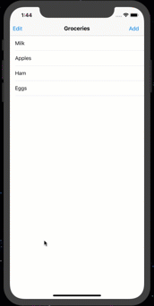

## Pull to Refresh Table View

### I learned how to:

- Create custom Refresh Control
- Stop refresh animation when data finishes updating
- Update the table with refreshed local data

Tools: react-native, native-base

