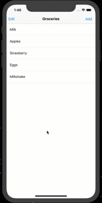

## Delete and Rearranging

### I learned how to:

- Remove data from Data Source
- Delete data from Table Row
- Animate the item deletion
- Handle rearranging Table Rows
- Enable swipe to delete Table Row

Tools: react-native, native-base, react-native-draggable-flatlist

