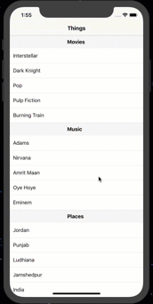

## Sticky Section Headers

### I learned how to:

- Use a Dictionary to dynamically fill a table with text
- Create Sticky Section Headers based off data in a Dictionary

Tools: react-native, native-base
